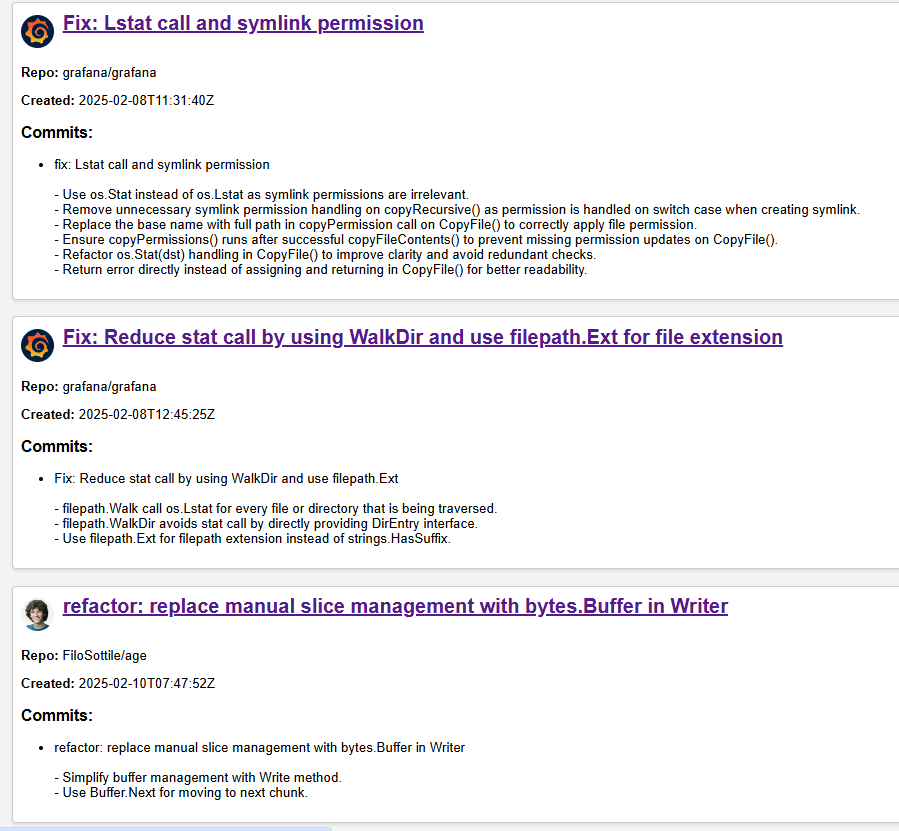

# GitHub PR Summary

A simple web application that fetches and displays a summary of **your open & merged pull requests** on GitHub.



## Setup

1. Clone the repository:
   ```sh
   git clone https://github.com/Vkanhan/go-PR.git
   ```
2. Navigate to the project folder:
   ```sh
   cd go-PR
   ```
3. Create a .env file and add your GitHub credentials:
    ```sh
    GITHUB_USERNAME=your_github_username
    GITHUB_TOKEN=your_github_token

4. Install dependencies:
   ```sh
   go mod tidy
   ```
5. Run the project:
   ```sh
   go run .
   ```
6. Open in your browser:
    ```sh
    http://localhost:8080
    ```